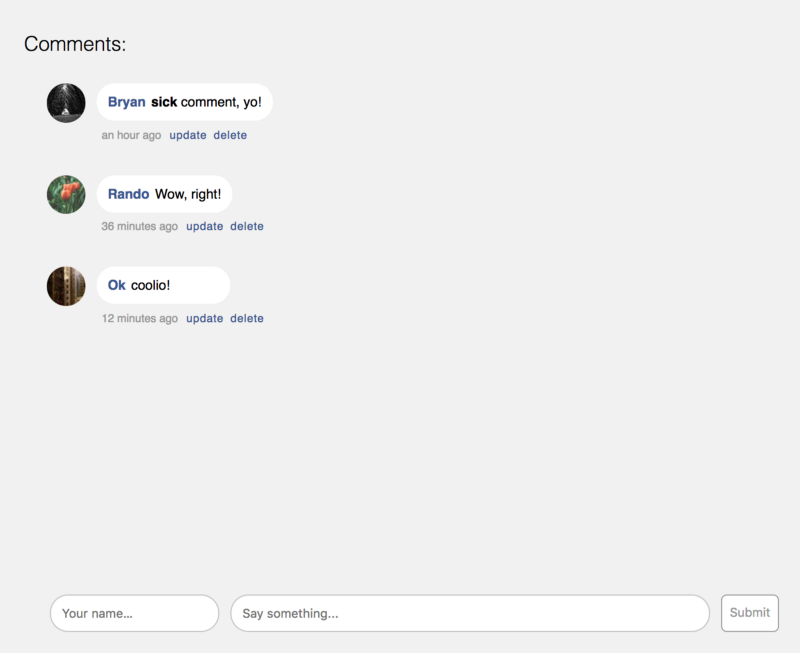

# Simple ReactJS Web App by MERN
This is a simple web application with basic CRUD operations for comments built on **MERN**.

## Installation
1. Download or clone this repo.
2. Run `$ yarn` under root and `/client` folders respectively.  
This will import all the packages defined in `package.json` files for server and client side.
3. Rename `.env.sample` file to `.env` under `/backend` folder.
4. Create a database named `mern-comment-box` locally.  
Or use [mLab](https://www.mlab.com/) which is a database-as-a-service provider for MongoDB.
5. Replace environment variable `DB_URI` value with your own one in `.env` file.
6. Run
    * `$ yarn start:server` will start server.
    * `$ yarn start:client` will start client.
    * `$ yarn start:dev` will start both server and client.
7. Navigate to `http://localhost:3000/`

## Screenshot
